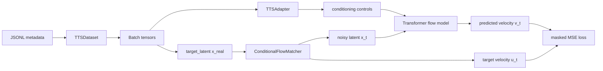
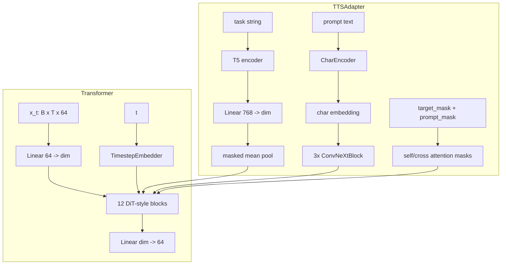
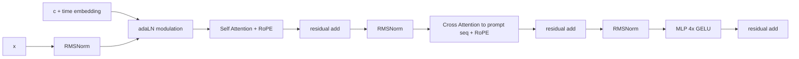
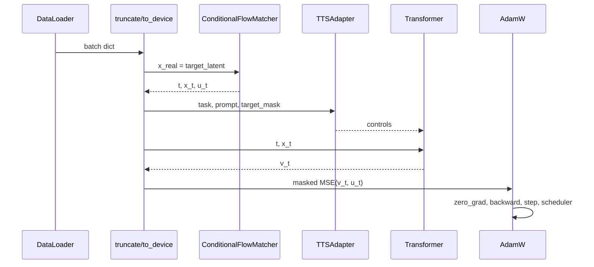
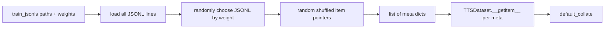

# TTS Training Details

This document describes the Text-to-Speech training path used by `docs/tts.md`,
`configs/tts/tts_ljspeech.yaml`, and `train.py`.

## 1. Model Architecture

### High-level TTS flow



### Main modules

The trainable model is `CombinedModel(base, adapter)`:



Default LJSpeech config:

| Component | Value |
| --- | --- |
| `base.name` | `Transformer` |
| latent input/output dim | `64` |
| hidden dim | `768` |
| layers | `12` |
| attention heads | `24` |
| head dim | `32` |
| RoPE max length | `8192` |
| adapter | `TTSAdapter` |

### TTSAdapter details

`TTSAdapter` creates the conditioning dictionary consumed by the Transformer:

```python
controls = {
    "c": task,                         # (B, 1, dim)
    "seq": prompt,                     # (B, text_len, dim)
    "self_attn_mask": self_attn_mask,  # (B, 1, T, T)
    "cross_attn_mask": cross_attn_mask # (B, 1, T, text_len)
}
```

Task conditioning:

1. Encode `data["task"]`, usually `"text to speech"`, with frozen `t5-base`.
2. Project T5 hidden size to model `dim`.
3. Masked mean-pool into one conditioning token `(B, 1, dim)`.

Prompt conditioning:

1. Normalize prompt with `CharEncoder`.
2. Convert chars to ids and pad.
3. Embed chars to `(B, text_len, dim)`.
4. Process with 3 ConvNeXt blocks.

The character vocabulary is lowercase English letters, digits, common
punctuation, and space. Characters outside the vocab are dropped by
`normalize_text`.

### Transformer block

Each block applies:



The block uses:

- RMSNorm before attention and FFN.
- `scaled_dot_product_attention`.
- RoPE on self-attention query/key and cross-attention query/key.
- DiT-style modulation from `c`, split into six tensors for shift, scale, and gates.

## 2. Model Training Details

### Training loop



For each batch:

1. `truncate_latent(data)` trims padded tensors to the maximum real latent length
   inside the batch.
2. `to_device(data, device)` moves tensors to `cuda`.
3. `x_real = data["target_latent"]`.
4. `noise = torch.randn_like(x_real)`.
5. `ConditionalFlowMatcher(sigma=0.)` samples:
   - `t`: flow time
   - `x_t`: interpolation/noisy latent location
   - `u_t`: target velocity
6. The adapter builds `controls`.
7. The Transformer predicts `v_t`.
8. Loss is masked MSE:

```python
loss = mean_pool((v_t - u_t) ** 2, data["target_mask"]).mean()
```

`mean_pool` only averages over valid latent frames according to `target_mask`.

### Optimizer and schedule

Default LJSpeech config:

| Setting | Value |
| --- | --- |
| optimizer | `AdamW` |
| lr | `1e-4` |
| warmup | linear warmup for `1000` steps |
| batch size per device | `8` |
| workers | `0` |
| training steps | `2000000` |
| device | `cuda` |
| logging | W&B unless `--no_log` |
| checkpoint interval | `100000` steps |
| validation interval | `10000` steps |

Important implementation notes:

- `train.py` is single-process PyTorch, not Accelerate/DDP.
- `precision` exists in the YAML but is not currently used for AMP in `train.py`.
- EMA is maintained with decay `0.999`.
- At `step % test_every_n_steps == 0`, validation samples train/test examples and
  decodes generated/ground-truth audio through the VAE.
- At `step % save_every_n_steps == 0`, the EMA model is saved.
- Since step starts at `0`, validation and checkpoint saving happen immediately
  on step 0 unless the config is changed.

### VAE latent contract

`compute_latents.ljspeech` writes one or more HDF5 files per waveform:

```text
latent: float32 array, shape (frames, 64)
attrs:
  fps: 25
  duration: seconds
  latent_type: "levo_vae"
```

For LJSpeech, `compute_latents.ljspeech` defaults to
`augmentation_repeats=10`. That means each utterance is saved as 10 jittered
latent files:

```text
LJ001-0001_000_of_010.h5
LJ001-0001_001_of_010.h5
...
LJ001-0001_009_of_010.h5
```

## 3. DataLoader Configuration

### JSONL schema

`create_jsonls.tts.ljspeech` creates entries like:

```json
{
  "task": "text to speech",
  "input": {
    "text": {
      "prompt": "example transcript",
      "language": "en"
    }
  },
  "target": {
    "audio": {
      "latent_path": "/path/to/latent.h5",
      "latent_type": "levo_vae",
      "fps": 25.0,
      "duration": 3.2
    }
  }
}
```

### Batching

`BatchJsonlSampler` controls batching:



Sampler behavior:

- Loads all configured JSONL files into memory.
- Chooses one JSONL source per batch using `random.choices(..., weights=...)`.
- Samples `batch_size_per_device` examples from that source.
- Shuffles indices and resets when a source is exhausted.
- Yields forever; `train.py` stops by checking `training_steps`.

### Dataset and latent cropping

`TTSDataset` is currently an alias of `TTMDataset`, so TTS uses the generic
text-to-audio dataset path:

```python
task = meta["task"]
prompt = meta["input"]["text"]["prompt"]
latent_path = meta["target"]["audio"]["latent_path"]
fps = meta["target"]["audio"]["fps"]
```

Frame selection:

```python
clip_frames = round(clip_duration * fps)
total_frames = get_audio_latent_length(latent_path)
start = sample_start_frame(total_frames, clip_frames)
latent, mask, length = load_audio_latent(latent_path, start, clip_frames)
```

For default LJSpeech:

```text
clip_duration = 10.0 seconds
fps = 25
clip_frames = 250
```

If the utterance is longer than `clip_frames`, a random contiguous crop is used.
If it is shorter, it is padded with zeros to `clip_frames`.

### Masking

`load_audio_latent` returns:

| Field | Shape before collate | Meaning |
| --- | --- | --- |
| `target_latent` | `(clip_frames, 64)` | cropped/padded VAE latent |
| `target_mask` | `(clip_frames,)` | `True` for real frames, `False` for padding |
| `target_length` | scalar | number of real frames before padding |

After `default_collate`:

| Field | Shape |
| --- | --- |
| `target_latent` | `(B, clip_frames, 64)` |
| `target_mask` | `(B, clip_frames)` |
| `target_length` | `(B,)` |
| `task` | `list[str]` |
| `prompt` | `list[str]` |

Then `truncate_latent` trims all batch latents and masks:

```python
max_len = max(data["target_length"])
data["target_latent"] = data["target_latent"][:, :max_len]
data["target_mask"] = data["target_mask"][:, :max_len]
```

This keeps the batch rectangular while avoiding unnecessary compute on padding
beyond the longest real sample in the batch.

### Attention masks

The adapter turns `target_mask` and `prompt_mask` into attention masks:

```python
self_attn_mask = target_mask[:, None, None, :] * target_mask[:, None, :, None]
cross_attn_mask = prompt_mask[:, None, None, :] * target_mask[:, None, :, None]
```

Shapes:

| Mask | Shape | Purpose |
| --- | --- | --- |
| `self_attn_mask` | `(B, 1, T, T)` | prevent latent self-attention over padded latent frames |
| `cross_attn_mask` | `(B, 1, T, text_len)` | prevent cross-attention from padded latent frames to padded text chars |

Both masks are boolean and are passed directly into
`torch.nn.functional.scaled_dot_product_attention`.

## Practical Paths for Full LJSpeech

The full extraction launched for this workspace writes to:

```text
/datasets/jimmy/audio_flow_tts_full/
  LJSpeech-1.1/
  latents/ljspeech/{train,valid,test}/audio/
  jsonls/tts/{train,valid,test}/ljspeech.jsonl
  logs/
```

The default config in `configs/tts/tts_ljspeech.yaml` expects relative paths
under the repo:

```text
./jsonls/tts/train/ljspeech.jsonl
./jsonls/tts/test/ljspeech.jsonl
```

For training from `/datasets/jimmy/audio_flow_tts_full`, either create a new
YAML that points `train_jsonls` and validation paths to the absolute JSONLs, or
symlink the generated JSONLs into the repo-local `jsonls/tts/...` paths.
